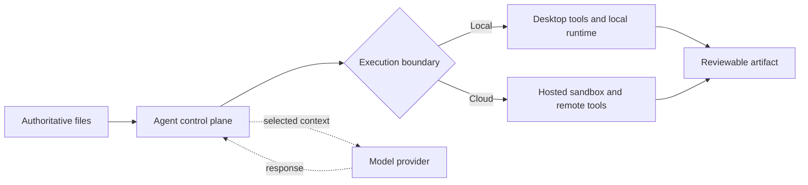

Choosing between a local-first and cloud agent workspace is not the same as choosing a local or cloud AI model. The workspace is where an agent finds files, remembers project state, runs tools, stores credentials, and leaves finished work. The model is only one participant inside that environment.

That distinction changes the buying decision. A desktop agent can call a cloud model while keeping the project anchored in ordinary folders. A cloud agent can use an open-weight model while storing the task, files, logs, and execution environment on a provider's infrastructure. The useful question is therefore not “Where is the AI?” but **“Where does the work live, and which system has authority to change it?”**

The short answer: choose local-first when direct access to files, portability, and operator control matter most. Choose cloud when work must continue without a particular computer, be shared across a team, or react to schedules and events around the clock. Choose hybrid only after documenting which data and actions may cross the boundary.

## The difference is the workspace boundary

A **local-first agent workspace** treats your computer and file system as the primary working environment. The application may still call cloud models, but project state and artifacts remain anchored in folders you can inspect and back up.

A **cloud agent workspace** keeps the durable task state, files, and runtime on provider-managed infrastructure. You can return from another device, invite collaborators, and let a task continue without keeping your computer awake.

This is separate from model location. It also involves more than storage. A useful boundary map accounts for five things: authoritative files, conversation and task state, tool execution, credentials, and audit history. A product may keep one locally and the others in the cloud, so labels such as “desktop,” “private,” or “local” are not enough by themselves.

| Decision | Local-first | Cloud |
|---|---|---|
| Primary state | User-controlled files and local app data | Provider-managed workspace and storage |
| Local file access | Direct and usually fast | Requires upload, sync, mount, or a desktop bridge |
| Background execution | Device usually must remain available | Can continue while the device is offline |
| Collaboration | Requires sharing or synchronization | Usually built into the workspace |
| Offline resilience | Strong for local operations | Limited without connectivity |
| Administration | User controls the machine and folders | Provider controls runtime; organization controls policies |

## What actually moves across the boundary

Every agent task has an input path, an execution path, and an output path. For a local-first workspace, a document may remain in a project folder while selected text is sent to a remote model; a local tool then writes the result back to disk. In a cloud workspace, the same document may first be uploaded or mounted into a hosted sandbox, processed there, and downloaded or synchronized afterward.

This creates four separate questions that privacy marketing often collapses into one:

1. **Storage:** Is the original file copied, indexed, cached, or retained outside the device?
2. **Inference:** Which text, images, or metadata reach the selected model provider?
3. **Execution:** Where do commands, browser actions, and file changes happen?
4. **Telemetry:** Which prompts, tool calls, errors, and outputs appear in service logs?

A local UI does not prove that inference or telemetry stays local. Conversely, cloud execution does not mean every local folder is exposed. The correct unit of review is the data path for a specific workflow.

The diagram deliberately keeps the model outside the storage decision. Selected context can cross to a model while authoritative files and final artifacts remain in a different execution boundary.

## Where local-first wins

Local-first is a strong default for work that already lives in folders: source code, research libraries, client documents, media, and long-running personal knowledge bases. The agent can read the same files as an editor without requiring a second canonical copy.

It also makes the result legible. If the agent creates a report, spreadsheet, or website, you can see the artifact in the file system, review a diff, restore a backup, or continue with another tool. This “everything is a file” model reduces dependence on one chat history or proprietary database.

It also suits workflows in which a person needs to inspect every change. Git diffs, filesystem history, local backups, and familiar desktop applications make the agent's output visible outside the vendor interface. If the agent stops working, the artifacts can still be opened with ordinary tools.

Local-first does not automatically mean private, secure, or offline. A remote model may receive selected content; a plugin may make network requests; and a local connector can hold powerful credentials. The device also becomes an availability dependency. Scheduled work stops when the computer sleeps unless another always-on runner takes over.

## Where cloud wins

Cloud workspaces are better at continuity. Anthropic's current [Cowork availability documentation](https://support.claude.com/en/articles/15520349-use-claude-cowork-on-web-desktop-and-mobile), for example, explains that scheduled tasks can run in the cloud without the computer staying awake. It also exposes the boundary: local files, local connectors, browser control, and computer use can still depend on Claude Desktop being online for the relevant action.

That pattern is useful because it makes the trade-off concrete. A cloud runtime can research, draft, monitor, and coordinate from anywhere. It cannot magically access a folder on a sleeping laptop unless that folder has been uploaded, synchronized, or exposed through an online bridge.

Cloud architecture also simplifies team access, centralized audit logs, policy updates, and elastic compute. Hosted sandboxes can keep a stable filesystem, install packages, expose a preview, and resume later. [OpenAI's sandbox documentation](https://developers.openai.com/api/docs/guides/agents/sandboxes) explicitly separates the harness control plane from the sandbox execution plane and supports local, Docker, self-hosted, and hosted providers.

The cost is a larger trust boundary. Task state, artifacts, credentials, snapshots, and logs may sit in systems the user does not operate. Cloud availability also creates a different failure mode: a provider outage, account suspension, changed quota, or revoked integration can interrupt access to both the agent and its workspace.

## Four workflows and the architecture they favor

### Editing a codebase or document library

If the authoritative material is already a directory under version control or backup, local-first avoids upload and synchronization overhead. The agent can work against the same tree as the editor, and reviewers can use existing diff and recovery tools. A hosted sandbox becomes useful when the code needs reproducible dependencies, untrusted execution, or a shareable preview.

### Monitoring and scheduled research

A task that watches sources overnight, prepares a morning brief, or responds to a webhook needs an always-on execution environment. Cloud is the natural default unless the user operates a home server or persistent workstation. Local files can still enter later through an explicit handoff instead of keeping the entire machine exposed.

### Working with regulated or client-confidential material

Neither label decides compliance. The important evidence is the actual data path, retention configuration, administrator controls, model endpoint, geographic scope, and contract. Local-first may reduce copying, but it can also place security responsibility on an unmanaged laptop. A managed cloud environment may offer stronger organizational controls while expanding vendor access.

### Producing media or compute-heavy artifacts

Large models, rendering, video, and data processing may exceed a laptop's capacity. A hybrid workflow can keep source assets and approvals local, send a bounded job to remote compute, then return an exportable artifact. The manifest or task package should state exactly which inputs are uploaded and which outputs are retained.

## Hybrid is a boundary, not a compromise

Hybrid is not automatically the safest or most capable option. It adds synchronization, identity, and recovery complexity. A good hybrid design separates the control plane from the execution plane: local files, sensitive credentials, and high-risk approvals can remain close to the user while a remote worker handles jobs that need uptime or shared compute.

A task package should contain the smallest necessary input, a clear output location, scoped credentials, an expiration time, and an approval policy. When remote work reaches a local file or consequential action, it should pause rather than silently broaden access.

This is also why [AI agent connectors](/blog/ai-agent-connectors-explained) matter. A connector is not just a cable between two products. It defines what data crosses the boundary and which actions become available.

## A nine-question decision test

1. **Where is the authoritative work?** If it is already in local folders, avoid unnecessary duplication.
2. **Must the task continue while your device is closed?** If yes, some cloud execution is required.
3. **Who needs to collaborate?** A shared cloud workspace may reduce coordination overhead.
4. **What can the agent change?** Write actions, payments, publishing, and deletion need narrow permissions and approval gates.
5. **Which data reaches the model?** Review inference separately from workspace storage.
6. **Where do credentials live?** Prefer short-lived, scoped tokens over permanent secrets inside a workspace.
7. **What happens during an outage?** Identify the tasks, files, and controls that remain available.
8. **How is work recovered?** Test snapshots, local backups, retries, and duplicate-action protection.
9. **How will you leave?** Prefer exportable files, clear logs, and recoverable state over an opaque task history.

## How to test a workspace before committing

Run one real project through both the normal path and a failure path. Use a representative directory, not a polished demo file. Record which files are copied, which domains receive traffic, which tools can write, and where the final artifact appears.

Then interrupt the workflow: close the laptop, revoke a connector, disconnect the network, or stop the hosted session. A production-ready workspace should make the resulting state understandable. It should not repeat a payment, send a message twice, overwrite the only copy, or leave the user guessing whether work is still running.

Finally, export the project and open its outputs without the agent product. Portability is not just a future migration concern; it is evidence that the work belongs to the user rather than to a transient chat interface.

## How Floatboat approaches the choice

Floatboat's product direction is a local-first [agent workspace](/blog/ai-workspace-agents) for knowledge workers: files, models, tools, reusable workflows, and human review share one desktop environment. The point is not to reject cloud services. It is to keep projects and deliverables visible while cloud models and integrations participate as replaceable parts.

That positioning favors control and artifact ownership. It does not remove the need for cloud models or remote services. It makes their role explicit: cloud capabilities can participate without becoming the only place where the work exists.

## The bottom line

Choose local-first when proximity to authoritative files, portability, and operator control outweigh the need for unattended execution. Choose cloud when uptime, collaboration, centralized administration, or elastic compute matters more than direct possession of the runtime. Choose hybrid when the workflow genuinely contains both kinds of step—and write down the boundary before granting access.

The architecture should disappear when work goes well and become obvious when something fails. If you cannot explain where the files, credentials, execution, and recovery state live, the workspace is not yet ready for important work.
