## TL;DR

- **Mermaid is a diagram language that lives inside Markdown fenced code blocks: you describe a flowchart, sequence diagram, or ER diagram as text, and a renderer draws it.** The code block declares `mermaid` as its language; everything inside is the diagram.
- It renders natively on GitHub and in Obsidian and most modern Markdown tools, as of 2026 — the diagram is versioned, diffed, and edited with the document, because it *is* the document.
- The syntax for basic flowcharts takes minutes; the honest limits are styling control, automatic layout (large graphs become hairballs), and rendering support that varies by platform and version.
- AI agents are now the fastest Mermaid authors — describing a diagram in words and getting editable Mermaid text is exactly what language models are good at.
- Diagrams-as-text fit the same philosophy as [Markdown itself](/blog/what-is-markdown): the source is plain text, readable forever, and the rendering is disposable.

## 1. The Idea: Diagrams as Code

Every diagram tool before Mermaid stored drawings. The file described shapes and coordinates, and editing meant dragging boxes until the arrows looked right. The file was opaque to version control, impossible to diff, and painful to update.

Mermaid inverts this. A diagram is declared as text inside a regular Markdown fenced code block:

````markdown
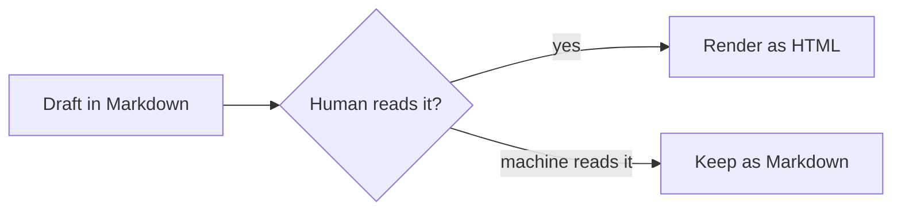
````

Direction is a single token — LR for left-to-right, TD for top-to-bottom — and it is the first layout decision every diagram makes. The same graph, read top down:

````markdown
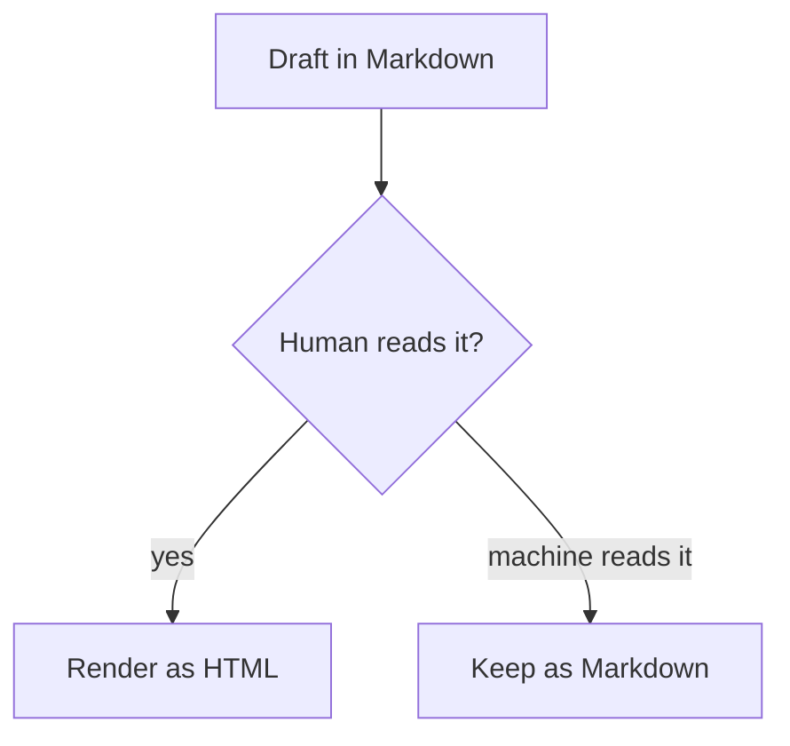
````

A renderer replaces the block with a drawn flowchart. The source stays plain text: reviewable in a pull request, editable in any editor, and understandable even where Mermaid does not render — the text reads like pseudocode for the diagram.

## 2. What Renders It — and What Doesn't

As of 2026, GitHub renders Mermaid blocks natively in files, issues, and pull requests. Obsidian renders them in notes, which turned it into a default tool for thinking-in-diagrams. Most documentation generators render them too — Docusaurus and MkDocs have Mermaid support built in or one plugin away, which is why [Markdown documentation sites](/blog/markdown-documentation-site) and Mermaid tend to be adopted together.

Not everything renders it. Strict CommonMark has no idea what a `mermaid` code block means; some older or minimal renderers show the source as a plain code block, which is the graceful failure mode — readable pseudocode rather than a broken image. The practical check is the same one tables need: render once in the platform you actually publish to before relying on it. A [browser-based Markdown preview](https://floatboat.ai/tools/markdown) is a quick spot-check for whether your renderer's GFM coverage includes what you wrote, though Mermaid specifically depends on the platform's own integration.

## 3. A Rendering Matrix for Real Platforms

Where does Mermaid actually work? The honest answer is a matrix rather than a yes or no, because every platform bundles its own copy of the Mermaid library and upgrades it on its own schedule. The same block can render perfectly in one tool and show raw text in another, and a diagram type that works everywhere today can fail on a platform pinned to an older release. The matrix below reflects practical day-to-day behavior as of 2026 rather than vendor promises — and the fastest way to extend it to your own stack is to paste one small diagram into each tool you publish to and look at what comes back.

| Platform | Native rendering | Version behavior | Failure mode |
|---|---|---|---|
| GitHub | Files, issues, pull requests | Pins a Mermaid release; new diagram types arrive late | Plain code block |
| Obsidian | Notes and live preview | Bundled version updates with the app | Plain code block |
| Notion | No native Mermaid block | N/A — shows source; embed the live editor for a picture | Source code |
| VS Code preview | Not built in | An extension adds it; the extension sets the version | Plain code block |
| Docusaurus / MkDocs | Plugin or built-in theme support | You control the pinned version in config | Build warning or code block |

The version column is the one people underestimate. Mindmaps, for example, arrived in the Mermaid 9.3 release, and a platform pinned to an older version will not draw them no matter how correct the syntax is. A documentation site you control can bump the library in config and get new diagram types immediately; GitHub upgrades globally, on GitHub's schedule and nobody else's. The workable rule: treat the newest diagram types as optional sugar, and keep diagrams that must render everywhere on the conservative core — flowchart, sequence, ER, state, gantt, pie.

The failure column is the reason this trade is acceptable. On almost every platform, unsupported Mermaid degrades to a plain code block — the readable-pseudocode failure mode rather than a broken image — so a diagram that fails never destroys the information around it. Notion is the outlier worth planning around: it shows the source and nothing else, and the common workarounds, embedding the Mermaid live editor or pasting an exported image, give up the very property that makes text diagrams valuable, which is that the source lives and versions with the document. The render-once check is the same discipline [Markdown tables](/blog/markdown-table-how-to) demand, only applied per platform instead of per document.

## 4. The Diagram Types Worth Knowing

Mermaid covers far more than flowcharts, and four types cover most real use.

**Flowcharts** (`flowchart LR` or `TD`) are the workhorse: boxes, decisions, and arrows for processes and decision trees. **Sequence diagrams** map exchanges between participants — the honest picture of an API conversation or an agent handoff. **Entity-relationship diagrams** describe database schemas. **Gantt charts** describe schedules. State diagrams earn a place on that list too, and two quick-sketch types — pie and mindmap — round out the tour below.

The syntax stays close to English: `A --> B` connects two nodes, labels ride on the arrows (`B -- yes --> C`), and shapes change meaning (`[brackets]` for process boxes, `{braces}` for decisions). [Mermaid's official documentation](https://mermaid.js.org/intro/) is the reference, and it is genuinely readable — the language was designed for non-designers.

### 4.1 Sequence Diagrams: Who Talks to Whom, in What Order

````markdown
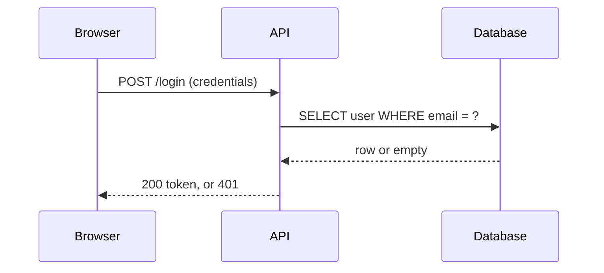
````

Two annotations earn their keep once diagrams land in code review. autonumber stamps every message with a step number, so an issue can say "step 3 fails" and everyone sees the same edge; Note over spells out shared context that would otherwise live in a side channel:

````markdown
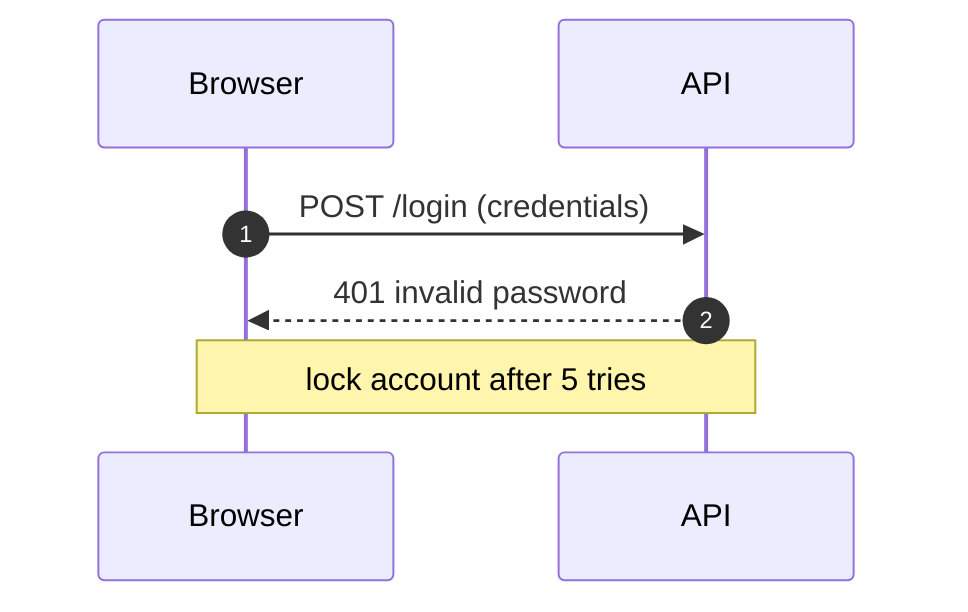
````

Participants become columns and messages become rows, so the picture matches the way an API conversation actually reads in a log. Solid arrows carry requests, dashed arrows carry responses back, and the top-to-bottom reading order is the order things happen in. This is the type developers reach for first after flowcharts, because author and reviewer read it the same way. When a sequence diagram needs more than about five participants, the conversation itself is usually the thing that needs redrawing.

### 4.2 State Diagrams: One Thing's Life Story

````markdown
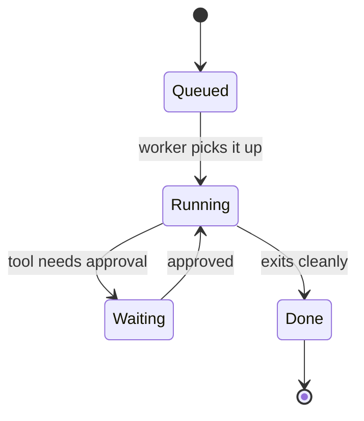
````

Real lifecycles also fail, and the transition lines carry that as easily as the happy path. The same task with a retry loop and a terminal failure state:

````markdown
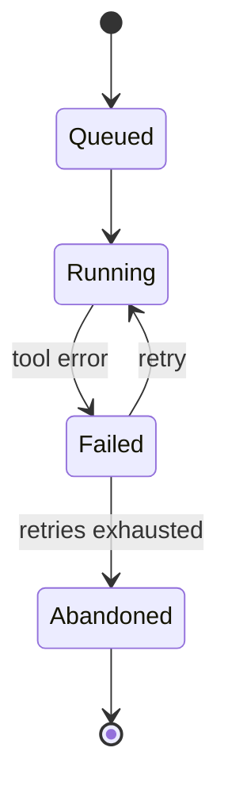
````

States are nouns and transitions are the events that move an object between them, which makes the syntax close to a literal transcription of a state machine definition. The typical subjects are things with a lifecycle: a task, an order, a deployment, a document under review. The distinction from a flowchart is worth keeping sharp — a flowchart answers "what happens next in this process," while a state diagram answers "what is this one thing allowed to do next."

### 4.3 Entity-Relationship Diagrams: Schemas as Text

````markdown
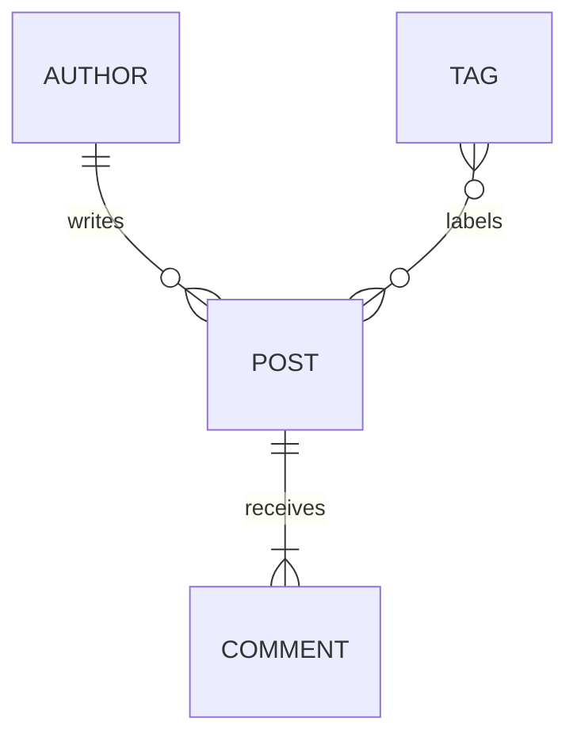
````

The same diagram carries attribute blocks when column names start mattering in the conversation. Under each entity, plain type-and-name lines list the fields:

````markdown
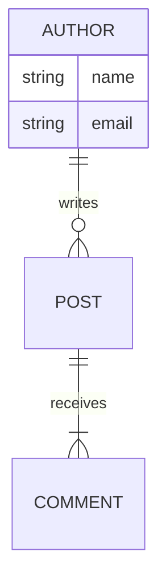
````

Crow's-foot notation compresses into a few punctuation marks: `||--o{` reads as one-to-zero-or-many. In a design discussion, the relationship lines alone are usually enough, and the attribute block under each entity can wait until the schema is serious. The payoff is the same as everywhere else in Mermaid: the schema sketch lives in the pull request that proposes it, and edits to it show up as a readable diff.

### 4.4 Gantt Charts: Schedules That Survive Edits

````markdown
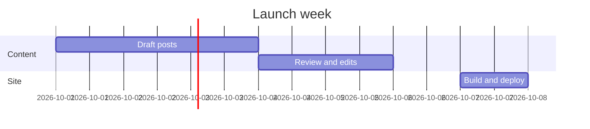
````

Durations chained with the after keyword, rather than absolute dates, express the same week as pure dependencies — change one duration and everything downstream moves:

````markdown
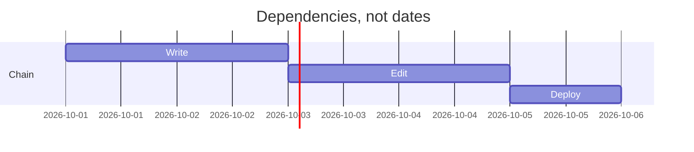
````

Sections group related tasks, and each task is a name plus a duration, so a schedule edit is a one-line change. Among the main types this is the least text-native — nobody enjoys doing date arithmetic by hand — and multi-month programs with resource leveling belong in a real planning tool. A launch week or a content sprint, though, holds up well, and it stays reviewable in a way no spreadsheet screenshot is.

### 4.5 Pie and Mindmap: The Quick-Sketch Types

````markdown
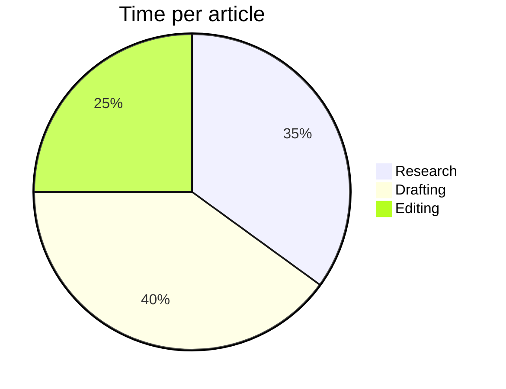
````

````markdown
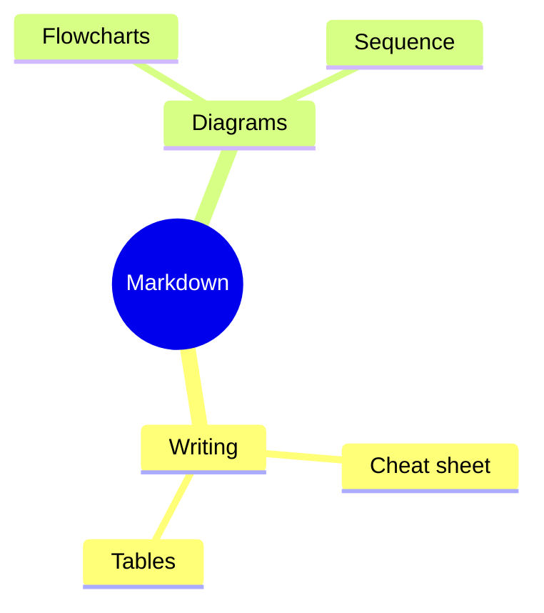
````

A pie chart earns its keep in postmortems and time audits, where three to five slices tell the story and more than that turns into noise. A mindmap is the first five minutes of brainstorming: there are no arrows to think about, only indentation, which is why it pairs so naturally with outliners like Obsidian. Both render small and read instantly, which is exactly the bar a text-based diagram should clear.

## 5. Syntax Traps Worth Knowing Before You Paste

Mermaid reads like English right up until a diagram fails to parse for a reason that takes ten minutes to find. The good news is that nearly every syntax failure traces back to a handful of habits, and they are the same across diagram types. If you already keep a [Markdown cheat sheet](/blog/markdown-cheat-sheet) open for the rest of Markdown's punctuation rules, Mermaid adds exactly one new habit — quote the label — plus the three smaller points below.

### 5.1 Quote Any Label That Isn't a Plain Word

Any label containing punctuation — parentheses, colons, commas, question marks — must be wrapped in double quotes, or the parser tries to read that punctuation as syntax. The failure is confusing because the diagram parses fine right up to the first special character and then dies mid-line, which makes the broken version and the fixed version worth seeing side by side:

````markdown
```mermaid
flowchart TD
    login[Login: attempt 2 (retry)] --> check{quota > 0?}
```
````

````markdown
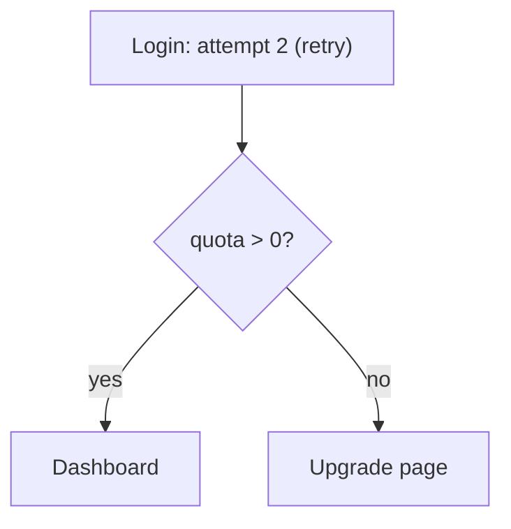
````

The broken block dies on the unquoted colon, the parentheses, and the comparison inside the braces; the fixed one quotes every label and parses anywhere. Two label positions still bite after you adopt the quoting habit. An arrow label containing a pipe is the classic, because pipes delimit the arrow-label syntax — quoting the text inside the pipes defuses it — and a square-bracket label that itself contains square brackets has a nesting problem quotes alone do not solve; rename the inner text instead.

### 5.2 Node IDs and Node Labels Are Different Things

In `A[Review queue]`, the `A` is the node ID and the bracketed text is only what gets displayed. Every edge, style rule, and class assignment references the ID, which means display text can be rewritten without touching the graph's wiring. IDs must be unique, cannot contain spaces, and earn their keep when they name a concept — `review`, `publish` — rather than a letter. One reserved-word trap is worth memorizing: a node IDed as lowercase `end` collides with the keyword that closes subgraphs, so call it `finish` or quote it.

### 5.3 Comments and Statement Separators

A `%%` prefix comments out the rest of a line, which is the sanctioned way to leave notes inside a diagram. Statements separate on newlines; semicolons work as separators too, so `A --> B; B --> C` on one line is legal. The trap runs in the other direction: a semicolon inside an unquoted label terminates the statement early, which is rule one — quote the label — wearing a different hat.

### 5.4 Chinese and Other Non-ASCII Labels

Chinese, Japanese, and Korean labels render correctly on the major platforms, and a bilingual diagram — ASCII keywords, Chinese display text — is entirely normal in practice. The diagram-type and direction keywords (`flowchart`, `LR`, `sequenceDiagram`) stay ASCII; only the labels carry local text. Two caveats keep surprises away: quote CJK labels containing full-width punctuation, and remember that some SVG and PDF export paths substitute fonts, which changes text width and can nudge a tight layout. Check the exported file, not just the live preview.

## 6. What Mermaid Does Badly

Honesty about the limits keeps diagrams maintainable. Precise layout control is not a Mermaid feature: the auto-layouter decides where boxes sit, and large graphs — more than a dozen nodes with cross-links — become unreadable hairballs no matter how carefully you write them. Pixel-perfect corporate styling is not the goal either; themes exist, but fine-grained brand styling fights the tool. And interactive or animated diagrams are out of scope entirely.

The pragmatic rule: Mermaid excels at small, structural diagrams that document logic — flows, sequences, schemas. It fails gracefully at poster-grade visuals. When a diagram needs to be beautiful, that is a job for a drawing tool; when it needs to be true, current, and versioned, that is Mermaid.

## 7. Themes and Styling: Less Than You're Offered

Mermaid ships themes — default, neutral, dark, forest, and base — and an init directive can select a theme and override its variables from the first line of any block. It is tempting to reach for that the first time a diagram goes into a branded document. The workmanlike advice is to use less styling than the tool offers, because styling is the part that stops being true when the diagram leaves the platform you tuned it on. What the directive looks like in full:

````markdown
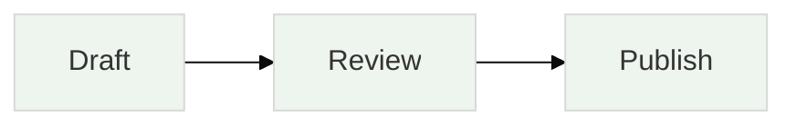
````

The version that actually ships, though, usually skips the directive entirely — default theme, one accent reserved for meaning:

````markdown
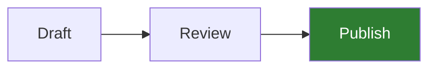
````

The init line must be the first line of the block, and everything it sets applies to that diagram alone. classDef covers the middle ground: define a named style once, then apply it to the nodes whose color means something — shipped, failed, waiting on a human. That is the entire legitimate use of color in a Mermaid diagram: encoding state, not decorating boxes.

There is also a dark-mode test hiding in this section. GitHub and Obsidian both flip themes, and a diagram tuned to look right on white — pale fills, light gray text — can wash out completely on dark. If a diagram needs custom colors to be readable, run it through both themes before it ships; if it uses the default theme with one accent, it usually survives both untouched.

## 8. AI Writes Mermaid Well

Describing a diagram in plain language and receiving editable diagram code is a near-perfect LLM task, and it has quietly changed how diagrams get made. Paste a process description to an agent, ask for a Mermaid flowchart, and the output is text you can fix by editing words — no canvas, no dragging.

This closes a loop with the rest of the Markdown ecosystem. An agent that reads a Markdown document can propose its architecture diagram in the same file format; a reviewer reads the diff of a diagram as text. The diagram becomes just another part of the document that [AI pipelines read and edit natively](/blog/markdown-for-ai-pipelines) — which is the entire reason text-based diagrams belong in a Markdown workflow at all.

### 8.1 A Prompt Pattern That Works

The reliable pattern is to state the diagram as facts before asking for code: the diagram type and direction, the participants by name, and the ordered list of messages or steps between them. A prompt that says "sequence diagram, top to bottom, participants Browser, API, Database," followed by the four messages in order, returns text that usually parses on the first try. Two constraints make it sturdier: a node budget — under ten, or the layout will suffer — and the quoting rule from the syntax section, restated so the model applies it.

```text
Draw a Mermaid sequence diagram, top to bottom.
Participants, in order: Browser, API, Database.
Messages, in order:
1. Browser sends POST /login with credentials
2. API queries the Database for the user
3. Database returns the row, or empty
4. API returns 200 with a token, or 401
Keep it under 8 nodes. Quote any label containing punctuation.
```

The prompt works because it is just the diagram described honestly — participants and sequence are the actual content of a sequence diagram, so the model is transcribing rather than inventing. Direction and participant order decide the layout, which is why they belong in the prompt instead of in after-the-fact edits. And if the first output is structurally right but cosmetically wrong, fix the words; regenerating a whole diagram to move one arrow is the canvas habit sneaking back in.

### 8.2 What to Check Before You Trust the Output

Trust the structure, verify the details. The checks that matter: every edge label states what actually triggers the transition; participants appear in the order they occur in reality; no node exists that the source process does not justify; and the diagram types used are supported on the platforms in the rendering matrix, not only in the newest Mermaid release. None of this is harder than reviewing a paragraph of prose — which is precisely the point.

The syntax errors AI makes most are the ones from the traps section: unquoted punctuation in labels, a lowercase `end` used as a node ID, inconsistent arrows (`-->` where a plain `--` was meant), and mindmaps indented with tabs instead of spaces. All of them are one-word fixes, which keeps the edit loop fast. An error that takes longer than a minute to find is usually a platform version gap rather than a syntax mistake, and the rendering matrix above is the first place to look.

## 9. Splitting a Diagram That Grew Too Big

Every Mermaid user eventually meets the diagram that grew. A release-notes pipeline started as a six-node flowchart; six months later it had twenty nodes and twenty-six edges spanning drafting, review, publishing, and distribution, and the auto-layouter wrapped it into a shape no reviewer could follow. Redrawing it smaller was not an option — all twenty nodes were real — so the fix was to split it along its natural joints.

The joints were the hand-offs where a different person or tool takes over, and they grouped the graph into three clusters: the draft loop, the review gate, and publish-and-distribute. Each cluster became its own diagram with explicit boundary nodes — an entry node like From review, an exit node like To distribution — so a reader can enter any sub-diagram and see where it hands off. A short indexed list in the text above the three diagrams now does the routing that the tangled cross-links used to do, and every sub-diagram stayed under eight nodes, comfortably inside the territory where the layout remains legible.

````markdown
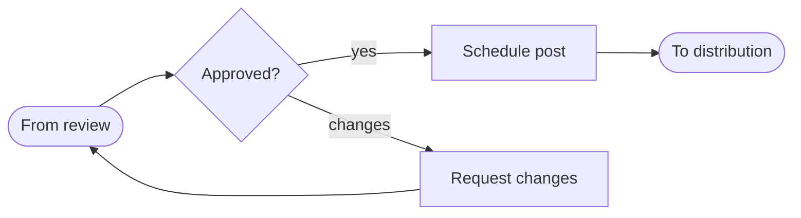
````

The publish-and-distribute cluster keeps the same convention, and its entry node repeats the gate's exit so the hand-off reads the same in both directions:

````markdown
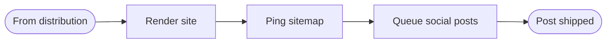
````

The split cost about twenty minutes, and the readable result has survived a dozen edits since. The lesson generalizes: when a Mermaid diagram stops being readable, the answer is almost never styling — it is that the diagram is carrying more than one idea, and each idea deserves its own block. Three small, boring, true diagrams beat one impressive hairball every time the document has to be maintained.

## 10. Conclusion

Mermaid turns the least maintainable artifact in documentation — the diagram — into a few lines of text that live, diff, and die with the document. The syntax takes minutes, the rendering support is broad as of 2026, and the failure mode everywhere else is readable pseudocode.

Next time a process explanation needs a picture, try describing the picture instead of drawing it.
