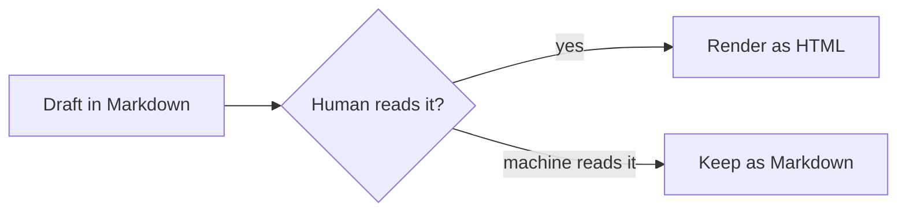

## TL;DR

- **Mermaid is a diagram language that lives inside Markdown fenced code blocks: you describe a flowchart, sequence diagram, or ER diagram as text, and a renderer draws it.** The code block declares `mermaid` as its language; everything inside is the diagram.
- It renders natively on GitHub and in Obsidian and most modern Markdown tools, as of 2026 — the diagram is versioned, diffed, and edited with the document, because it *is* the document.
- The syntax for basic flowcharts takes minutes; the honest limits are styling control, automatic layout (large graphs become hairballs), and rendering support that varies by platform and version.
- AI agents are now the fastest Mermaid authors — describing a diagram in words and getting editable Mermaid text is exactly what language models are good at.
- Diagrams-as-text fit the same philosophy as [Markdown itself](/blog/what-is-markdown): the source is plain text, readable forever, and the rendering is disposable.

## 1. The Idea: Diagrams as Code

Every diagram tool before Mermaid stored drawings. The file described shapes and coordinates, and editing meant dragging boxes until the arrows looked right. The file was opaque to version control, impossible to diff, and painful to update.

Mermaid inverts this. A diagram is declared as text inside a regular Markdown fenced code block:

````markdown

````

A renderer replaces the block with a drawn flowchart. The source stays plain text: reviewable in a pull request, editable in any editor, and understandable even where Mermaid does not render — the text reads like pseudocode for the diagram.

## 2. What Renders It — and What Doesn't

As of 2026, GitHub renders Mermaid blocks natively in files, issues, and pull requests. Obsidian renders them in notes, which turned it into a default tool for thinking-in-diagrams. Most documentation generators render them too — Docusaurus and MkDocs have Mermaid support built in or one plugin away, which is why [Markdown documentation sites](/blog/markdown-documentation-site) and Mermaid tend to be adopted together.

Not everything renders it. Strict CommonMark has no idea what a `mermaid` code block means; some older or minimal renderers show the source as a plain code block, which is the graceful failure mode — readable pseudocode rather than a broken image. The practical check is the same one tables need: render once in the platform you actually publish to before relying on it. A [browser-based Markdown preview](https://floatboat.ai/tools/markdown) is a quick spot-check for whether your renderer's GFM coverage includes what you wrote, though Mermaid specifically depends on the platform's own integration.

## 3. The Diagram Types Worth Knowing

Mermaid covers far more than flowcharts, and four types cover most real use.

**Flowcharts** (`flowchart LR` or `TD`) are the workhorse: boxes, decisions, and arrows for processes and decision trees. **Sequence diagrams** map exchanges between participants — the honest picture of an API conversation or an agent handoff. **Entity-relationship diagrams** describe database schemas. **Gantt charts** describe schedules.

The syntax stays close to English: `A --> B` connects two nodes, labels ride on the arrows (`B -- yes --> C`), and shapes change meaning (`[brackets]` for process boxes, `{braces}` for decisions). [Mermaid's official documentation](https://mermaid.js.org/intro/) is the reference, and it is genuinely readable — the language was designed for non-designers.

## 4. What Mermaid Does Badly

Honesty about the limits keeps diagrams maintainable. Precise layout control is not a Mermaid feature: the auto-layouter decides where boxes sit, and large graphs — more than a dozen nodes with cross-links — become unreadable hairballs no matter how carefully you write them. Pixel-perfect corporate styling is not the goal either; themes exist, but fine-grained brand styling fights the tool. And interactive or animated diagrams are out of scope entirely.

The pragmatic rule: Mermaid excels at small, structural diagrams that document logic — flows, sequences, schemas. It fails gracefully at poster-grade visuals. When a diagram needs to be beautiful, that is a job for a drawing tool; when it needs to be true, current, and versioned, that is Mermaid.

## 5. AI Writes Mermaid Well

Describing a diagram in plain language and receiving editable diagram code is a near-perfect LLM task, and it has quietly changed how diagrams get made. Paste a process description to an agent, ask for a Mermaid flowchart, and the output is text you can fix by editing words — no canvas, no dragging.

This closes a loop with the rest of the Markdown ecosystem. An agent that reads a Markdown document can propose its architecture diagram in the same file format; a reviewer reads the diff of a diagram as text. The diagram becomes just another part of the document that [AI pipelines read and edit natively](/blog/markdown-for-ai-pipelines) — which is the entire reason text-based diagrams belong in a Markdown workflow at all.

## 6. Conclusion

Mermaid turns the least maintainable artifact in documentation — the diagram — into a few lines of text that live, diff, and die with the document. The syntax takes minutes, the rendering support is broad as of 2026, and the failure mode everywhere else is readable pseudocode.

Next time a process explanation needs a picture, try describing the picture instead of drawing it.
