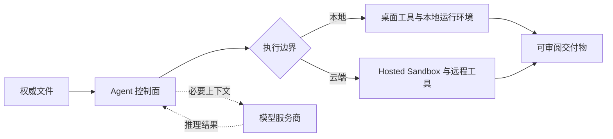

选择本地优先还是云端 Agent 工作站，不能只看模型运行在哪里。Workspace 决定 Agent 去哪里找文件、怎样保留项目状态、在哪里执行工具、凭证交给谁，以及完成后的结果存放在哪里；模型只是其中一个推理环节。

因此，真正需要回答的不是“AI 在本地还是云端”，而是：**工作以哪里为准，哪个系统有权修改它？** 本地桌面应用完全可以调用云端模型，云端 Workspace 也可以使用开源模型。两者并不矛盾。

如果工作围绕真实目录、可迁移文件和人工审阅展开，本地优先通常更合适；如果任务必须在电脑关闭后继续、跨设备接续或供团队共同处理，云端更有优势。混合架构只有在明确写出数据与权限边界后才有意义。

## 先看工作状态放在哪里

**本地优先的 Agent 工作站**把电脑和文件系统当作主要工作环境。模型可以来自云端，但项目状态、过程文件和交付物以用户可见的文件为中心。

**云端 Agent 工作站**把任务状态、文件和运行环境放在服务商管理的基础设施中。用户可以换设备继续工作，也可以让任务在电脑离线后继续执行。

判断边界时至少要拆开五部分：权威文件、任务状态、工具执行、凭证和审计记录。一个产品可能只把文件留在本地，却把提示词、日志与执行状态放在云端，所以“桌面端”“私有”“本地”这些标签本身不能证明数据路径。

| 判断维度 | 本地优先 | 云端 |
|---|---|---|
| 主要状态 | 用户控制的文件和本地应用数据 | 服务商管理的工作空间和存储 |
| 本地文件 | 直接访问，通常更自然 | 需要上传、同步、挂载或桌面桥接 |
| 后台执行 | 通常要求设备在线 | 设备关闭后仍可继续 |
| 多人协作 | 依赖共享或同步机制 | 通常原生提供 |
| 离线能力 | 本机任务韧性更强 | 高度依赖网络 |
| 管理边界 | 用户控制机器和目录 | 服务商控制运行时，组织控制策略 |

## 一次任务中究竟有哪些数据会移动

Agent 任务至少包含输入、执行和输出三条路径。本地优先场景下，原始文档可以留在项目目录，只把完成推理所需的片段发送给远程模型，再由本地工具把结果写回磁盘。云端场景下，文档可能先被上传或挂载到 Hosted Sandbox，处理完成后再下载或同步回来。

检查隐私和控制权时，需要分别问四件事：

1. **存储：**原始文件是否被复制、索引、缓存或长期保留？
2. **推理：**哪些文字、图片和元数据会发送给模型服务商？
3. **执行：**命令、浏览器操作和文件修改具体发生在哪里？
4. **日志：**提示词、工具调用、错误和输出会进入哪些遥测系统？

本地界面不代表推理和日志都留在本机；云端执行也不代表服务商可以读取所有本地目录。应当审查一条具体工作流的数据路径，而不是只相信架构标签。

图中刻意把模型放在存储决策之外：必要上下文可以发送给模型，但权威文件和最终交付物仍可位于另一条执行边界中。

## 本地优先适合什么工作

如果工作本来就存在于文件夹中，例如代码仓、研究资料、客户文档、媒体素材和个人知识库，本地优先通常更顺手。Agent 和编辑器看到的是同一批文件，不必再制造一份隐蔽的副本。

交付物也更容易检查。Agent 生成报告、表格或网页后，可以直接查看文件、比较差异、恢复备份，甚至换一个工具继续处理。这种“一切皆文件”的方式降低了对单一聊天记录或封闭数据库的依赖。

对于必须逐项审阅变更的任务，本地优先还有一个现实优势：Git diff、文件历史、系统备份和已有桌面软件都能参与验收。即使 Agent 产品停止服务，文件仍能由普通工具打开。

但本地优先不等于绝对离线、安全或隐私。远程模型仍可能接收选中的内容，插件可能发起网络请求，本地 Connector 也可能持有高权限凭证。与此同时，电脑本身成为可用性依赖：设备休眠后，定时任务通常无法继续。

## 云端适合什么工作

云端的核心优势是连续性。Anthropic 当前的 [Cowork 多端说明](https://support.claude.com/en/articles/15520349-use-claude-cowork-on-web-desktop-and-mobile)显示，定时任务可以在云端运行，不再要求电脑持续开机；但访问本地文件、本地 Connector、浏览器或电脑操作时，相关动作仍可能依赖 Claude Desktop 在线。

这个例子很好地揭示了真实边界：云端 Agent 可以持续研究、写作、监控和协调，却不能凭空读取一台已经离线的电脑。除非文件已经上传、同步，或者通过在线桥接开放出来。

对于团队，云端还能统一协作、审计日志、策略更新和算力配置。Hosted Sandbox 可以保存工作目录、安装依赖、开放预览并在之后恢复。[OpenAI 的 Sandbox Agents 文档](https://developers.openai.com/api/docs/guides/agents/sandboxes)进一步区分了负责调度、审批和恢复的控制面，以及真正读写文件、运行命令的执行面，并允许选择本地、Docker、自托管或托管环境。

代价是信任边界扩大：任务状态、交付物、凭证、快照和日志可能存放在用户无法直接管理的系统中。云端还会产生另一类中断风险——服务商故障、账号停用、配额变化或集成撤权，可能同时影响 Agent 和整个 Workspace。

## 四类工作分别适合哪种架构

### 编辑代码仓和大型资料目录

如果权威资料本来就在受版本控制或备份的目录里，本地优先可以减少上传与同步成本。Agent 与编辑器操作同一棵目录，审阅者继续使用熟悉的 diff 和恢复工具。当任务需要固定依赖、不可信代码隔离或共享预览时，再把有边界的副本放入 Hosted Sandbox 更合理。

### 定时监控和持续调研

夜间监控信息源、每天生成晨报或响应 Webhook，都需要持续在线的执行环境。除非用户自己维护常开主机，否则云端是自然选择。本地文件可以在后续明确交接，而不必为了一个监控任务长期开放整台电脑。

### 处理受监管或客户保密资料

“本地”和“云端”都不能直接等于合规。需要核对的是实际数据路径、保留设置、管理员控制、模型端点、部署地区与合同范围。本地优先可以减少副本，却可能把安全责任留给一台缺少管理的个人电脑；企业云环境扩大供应商边界，但也可能提供更完整的组织级策略。

### 生成视频、网站或计算密集型成果

渲染、大规模数据处理和生成式媒体可能超过笔记本能力。混合流程可以把源素材与审批留在本地，只发送有明确范围的远程任务，再取回可导出的成果。任务包需要说明上传了哪些输入、保留哪些输出，以及远程凭证何时失效。

## 混合架构要把边界写清楚

混合架构不一定更安全，也不一定更先进，它会额外引入同步、身份和故障恢复成本。成熟的组合方式应拆开控制面和执行面：本地保留权威文件、敏感凭证和关键审批；云端承担持续在线或需要共享算力的任务。

交给远程环境的任务包应只包含必要输入、明确输出位置、最小权限凭证、有效期和审批策略。远程任务遇到本地文件或高风险动作时，应暂停等待设备上线或人工确认，而不是自动扩大权限。

这也是为什么 [Agent Connector](/zh/blog/ai-agent-connectors-explained) 不只是「接入一个应用」。它决定哪些数据能够跨过边界，以及 Agent 获得哪些执行动作。

## 用九个问题做决定

1. **权威文件在哪里？** 如果本来就在本地目录，不要无意义地复制一套真源。
2. **电脑关闭后任务是否必须继续？** 如果答案是肯定的，就需要某种云端执行。
3. **谁需要共同参与？** 多人共享的云端工作空间通常更省协调成本。
4. **Agent 能修改什么？** 发布、付款、删除和写入操作需要更窄的权限与审批。
5. **哪些数据会发送给模型？** 模型推理与 Workspace 存储需要分别审查。
6. **凭证放在哪里？** 优先选择短期、限定范围的 Token，避免把长期密钥放进工作目录。
7. **服务中断时还能做什么？** 明确仍可访问的文件、任务和控制入口。
8. **怎样恢复失败任务？** 测试快照、备份、重试机制与防止重复动作的能力。
9. **以后怎么迁移？** 可导出的文件、清楚的日志和可恢复状态，比封闭任务历史更重要。

## 购买或迁移前，先做一次故障测试

不要只用厂商准备好的演示文件。选一个有代表性的真实项目，记录哪些文件被复制、网络请求发送到哪里、哪些工具拥有写权限，以及最终成果出现在哪个位置。

然后主动打断任务：合盖电脑、撤销 Connector、断开网络或终止 Hosted Session。合格的工作站应让当前状态保持可理解，不会重复付款、重复发送消息、覆盖唯一文件，也不会让用户无法判断后台是否仍在运行。

最后把项目导出，并尝试不用原 Agent 产品打开成果。可迁移性不只是未来换平台时才考虑，它直接证明工作属于用户，而不是被困在一次聊天界面里。

## Floatboat 的选择

Floatboat 选择的是面向知识工作者的本地优先 [Agent 工作站](/zh/blog/ai-workspace-agents)：文件、模型、工具、可复用流程和人工审阅处在同一个桌面工作环境里。重点不是拒绝云端，而是让项目和交付物始终可见，把模型与远程集成作为可替换的参与者。

这条路线强调控制权和交付物归属，但不排斥云端模型和远程服务。更准确的说法是：云端能力可以参与工作，却不必成为工作唯一存在的地方。

## 最后的选择标准

重视权威文件、可迁移性和操作人员控制，优先考虑本地优先；重视持续执行、跨设备、集中管理或弹性算力，优先考虑云端；只有不同步骤确实拥有不同信任和在线要求时，才选择混合架构。

系统运行顺利时，架构最好不打扰工作；出现故障时，边界必须清楚可见。如果无法说明文件、凭证、执行环境与恢复状态分别在哪里，这套 Workspace 还不适合承载重要任务。
