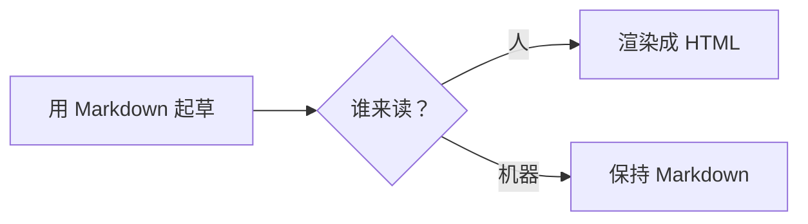

## TL;DR

- **Mermaid 是一种住在 Markdown 围栏代码块里的图表语言：用文字描述流程图、时序图或 ER 图，渲染器负责画出来。** 代码块声明语言为 `mermaid`，块内的一切就是图表本身。
- 截至 2026 年，GitHub 原生渲染 Mermaid，Obsidian 和多数现代 Markdown 工具也都支持——图表跟着文档一起被版本化、被 diff、被编辑，因为它*就是*文档的一部分。
- 基础流程图语法几分钟学会；诚实的短板是样式控制、自动布局（大图会变毛线团）以及各平台各版本的渲染支持不一。
- AI agent 现在是写出 Mermaid 最快的作者——用自然语言描述图表、拿到可编辑的 Mermaid 文本，正是语言模型最擅长的事。
- 文本图表与 [Markdown 本身](/zh/blog/what-is-markdown)是同一种哲学：源码是永远可读的纯文本，渲染是一次性的。

## 1. 思路：把图表当代码

Mermaid 之前的所有图表工具存的都是「画」。文件描述的是形状和坐标，编辑意味着拖拽方框直到箭头看得过去。这种文件对版本控制不透明、无法 diff、更新痛苦。

Mermaid 把这一切倒转过来。图表被声明为普通 Markdown 围栏代码块里的文字：

````markdown

````

渲染器把这个块替换成画好的流程图。源码保持纯文本：可以在 pull request 里评审、在任何编辑器里修改，甚至在 Mermaid 不渲染的地方也看得懂——那段文字读起来就像图表的伪代码。

## 2. 什么渲染它——什么不渲染

截至 2026 年，GitHub 在文件、issue 和 pull request 中原生渲染 Mermaid 块。Obsidian 在笔记里渲染它，这让 Obsidian 成了「用图表思考」的默认工具。多数文档生成器也渲染——Docusaurus 和 MkDocs 内置或一个插件就能支持，这也是 [Markdown 文档站](/zh/blog/markdown-documentation-site)和 Mermaid 总是一起被采纳的原因。

不是所有地方都渲染。严格 CommonMark 完全不知道 `mermaid` 代码块是什么；一些老派或极简渲染器会把源码显示成普通代码块——这是体面的失败方式：看到的是可读伪代码，而不是一张裂图。实操检查和表格一样：发布前在真正要发布的平台上渲染一次。[浏览器端的 Markdown 预览](https://floatboat.ai/zh/tools/markdown)适合快速抽查 GFM 覆盖范围，不过 Mermaid 具体取决于平台自己的集成。

## 3. 值得认识的图表类型

Mermaid 覆盖的远不止流程图，而四种类型覆盖了大多数真实用途。

**流程图**（`flowchart LR` 或 `TD`）是主力：方框、判断、箭头，画流程和决策树。**时序图**刻画参与者之间的消息往来——API 对话或 agent 交接的诚实画像。**实体关系图（ER）**描述数据库模式。**甘特图**描述排期。

语法贴近英语：`A --> B` 连接两个节点，标签放在箭头上（`B -- yes --> C`），形状改变含义（`[方括号]` 是处理框，`{花括号}` 是判断）。[Mermaid 官方文档](https://mermaid.js.org/intro/)是权威参考，而且真的可读——这门语言就是为非设计师设计的。

## 4. Mermaid 不擅长什么

对短板诚实，图表才维护得下去。精确的版式控制不是 Mermaid 的功能：自动布局决定方框的位置，大图——超过十几个节点还带交叉链接——无论你写得多仔细都会变成毛线团。像素级的品牌化样式也不是它的目标；主题存在，但精细的企业视觉规范会和工具对抗。交互式、动画式图表则完全超出范围。

务实的规则：Mermaid 擅长小型、结构化、记录逻辑的图——流程、时序、模式。它对海报级视觉是优雅地失败。当图表需要漂亮，那是绘图工具的工作；当图表需要真实、即时、可版本化，那是 Mermaid 的。

## 5. AI 写 Mermaid 又快又好

「用自然语言描述一张图，拿到可编辑的图表代码」是一个近乎完美的 LLM 任务，它已经悄悄改变了图表的生产方式。把一段流程描述粘给 agent，要一张 Mermaid 流程图，得到的是可以靠改文字来修的文本——没有画布，没有拖拽。

这和 Markdown 生态的其余部分接成了一个闭环。读取 Markdown 文档的 agent，可以用同一文件格式提出它的架构图；评审者把图表的变更当代码 diff 来读。图表变成了 [AI 管线原生读写](/zh/blog/markdown-for-ai-pipelines)的文档的一部分——这正是文本图表属于 Markdown 工作流的全部理由。

## 6. 结语

Mermaid 把文档里最难维护的产物——图表——变成了几行与文档同生共死、同 diff 同消亡的文本。语法几分钟上手，截至 2026 年渲染支持已经足够广，而在所有不支持的地方，失败方式都是可读的伪代码。

下次某个流程说明需要一张图，试试先「描述」那张图，而不是去画它。
