## TL;DR

- **Mermaid 是一种住在 Markdown 围栏代码块里的图表语言：用文字描述流程图、时序图或 ER 图，渲染器负责画出来。** 代码块声明语言为 `mermaid`，块内的一切就是图表本身。
- 截至 2026 年，GitHub 原生渲染 Mermaid，Obsidian 和多数现代 Markdown 工具也都支持——图表跟着文档一起被版本化、被 diff、被编辑，因为它*就是*文档的一部分。
- 基础流程图语法几分钟学会；诚实的短板是样式控制、自动布局（大图会变毛线团）以及各平台各版本的渲染支持不一。
- AI agent 现在是写出 Mermaid 最快的作者——用自然语言描述图表、拿到可编辑的 Mermaid 文本，正是语言模型最擅长的事。
- 文本图表与 [Markdown 本身](/zh/blog/what-is-markdown)是同一种哲学：源码是永远可读的纯文本，渲染是一次性的。

## 1. 思路：把图表当代码

Mermaid 之前的所有图表工具存的都是「画」。文件描述的是形状和坐标，编辑意味着拖拽方框直到箭头看得过去。这种文件对版本控制不透明、无法 diff、更新痛苦。

Mermaid 把这一切倒转过来。图表被声明为普通 Markdown 围栏代码块里的文字：

````markdown
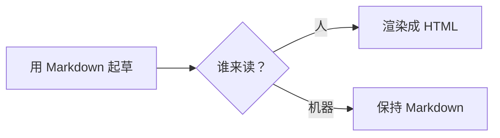
````

方向只是一个标记——LR 从左到右，TD 从上到下——它是每张图的第一个布局决策。同一张图，竖着读：

````markdown
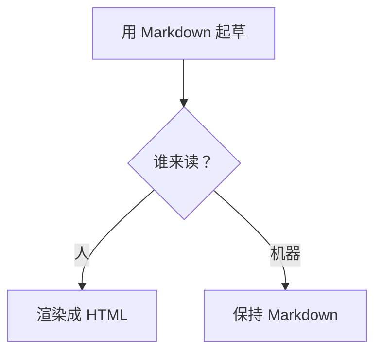
````

渲染器把这个块替换成画好的流程图。源码保持纯文本：可以在 pull request 里评审、在任何编辑器里修改，甚至在 Mermaid 不渲染的地方也看得懂——那段文字读起来就像图表的伪代码。

## 2. 什么渲染它——什么不渲染

截至 2026 年，GitHub 在文件、issue 和 pull request 中原生渲染 Mermaid 块。Obsidian 在笔记里渲染它，这让 Obsidian 成了「用图表思考」的默认工具。多数文档生成器也渲染——Docusaurus 和 MkDocs 内置或一个插件就能支持，这也是 [Markdown 文档站](/zh/blog/markdown-documentation-site)和 Mermaid 总是一起被采纳的原因。

不是所有地方都渲染。严格 CommonMark 完全不知道 `mermaid` 代码块是什么；一些老派或极简渲染器会把源码显示成普通代码块——这是体面的失败方式：看到的是可读伪代码，而不是一张裂图。实操检查和表格一样：发布前在真正要发布的平台上渲染一次。[浏览器端的 Markdown 预览](https://floatboat.ai/zh/tools/markdown)适合快速抽查 GFM 覆盖范围，不过 Mermaid 具体取决于平台自己的集成。

## 3. 真实平台的渲染矩阵

「Mermaid 到底哪里能用？」诚实的答案是一张矩阵，而不是一个是否——因为每个平台都自带一份 Mermaid 库，并按自己的节奏升级。同一段代码块，在这个工具里画得漂漂亮亮，在另一个工具里就是一段裸文本；今天处处能渲染的图类型，明天可能卡在一个锁定旧版本的平台上升不了级。下面的矩阵反映的是 2026 年的日常实际表现，不是厂商承诺——想把它推广到自己的技术栈，最快的办法是往每个发布平台粘一张小图，看看吐出来的是什么。

| 平台 | 原生渲染 | 版本行为 | 失败形态 |
|---|---|---|---|
| GitHub | 文件、issue、pull request | 锁定某个 Mermaid 版本；新图类型来得晚 | 普通代码块 |
| Obsidian | 笔记与实时预览 | 随应用更新自带版本 | 普通代码块 |
| Notion | 无原生 Mermaid 块 | 不适用——只显示源码；想要图就嵌入在线编辑器 | 源码 |
| VS Code 预览 | 不内置 | 装扩展才有；版本由扩展决定 | 普通代码块 |
| Docusaurus / MkDocs | 插件或主题内置 | 版本由你在配置里锁定 | 构建警告或代码块 |

版本这一列最容易被低估。比如 mindmap 是 Mermaid 9.3 才加入的，锁定旧版本的平台无论如何画不出来——语法再对也没用。你自己控制的文档站可以在配置里升库，立刻拿到新图类型；GitHub 则全局统一升级，按 GitHub 的日程表来，谁也催不动。可行的规则是：把最新的图类型当可选的糖，需要处处渲染的图，守住保守的核心集合——流程图、时序图、ER 图、状态图、甘特图、饼图。

失败形态这一列说明了为什么这笔交易划算。在几乎所有平台上，不支持的 Mermaid 会退化成普通代码块——可读伪代码，而不是裂图——图挂了也不会毁掉周围的信息。Notion 值得单独规划：它只显示源码，常见 workaround（嵌入 Mermaid 在线编辑器、或者贴一张导出的图）恰恰放弃了文本图表最有价值的性质——源码跟着文档一起活着、一起进版本历史。发布前渲染一次的检查，和 [Markdown 表格](/zh/blog/markdown-table-how-to)要求的是同一种纪律，只是要按平台逐个执行。

## 4. 值得认识的图表类型

Mermaid 覆盖的远不止流程图，而四种类型覆盖了大多数真实用途。

**流程图**（`flowchart LR` 或 `TD`）是主力：方框、判断、箭头，画流程和决策树。**时序图**刻画参与者之间的消息往来——API 对话或 agent 交接的诚实画像。**实体关系图（ER）**描述数据库模式。**甘特图**描述排期。状态图也配得上这个名单，另外两个速写型的图——饼图和思维导图——放在下面的巡礼里收尾。

语法贴近英语：`A --> B` 连接两个节点，标签放在箭头上（`B -- yes --> C`），形状改变含义（`[方括号]` 是处理框，`{花括号}` 是判断）。[Mermaid 官方文档](https://mermaid.js.org/intro/)是权威参考，而且真的可读——这门语言就是为非设计师设计的。

### 4.1 时序图：谁和谁说话，按什么顺序

````markdown
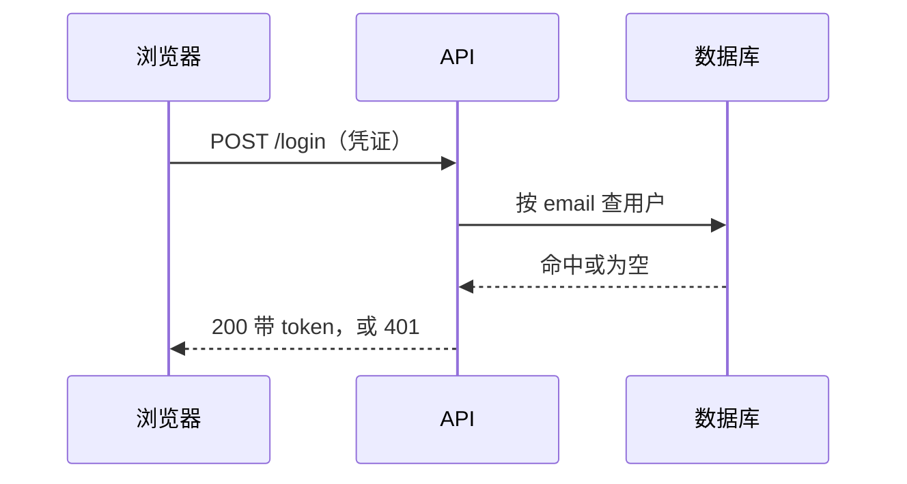
````

图一旦进入代码评审，两个标注就派上了用场。autonumber 给每条消息编号，issue 里可以写「第 3 步挂了」，所有人看到的都是同一条边；Note over 把本该躲在侧频道里的共享上下文写在图面上：

````markdown
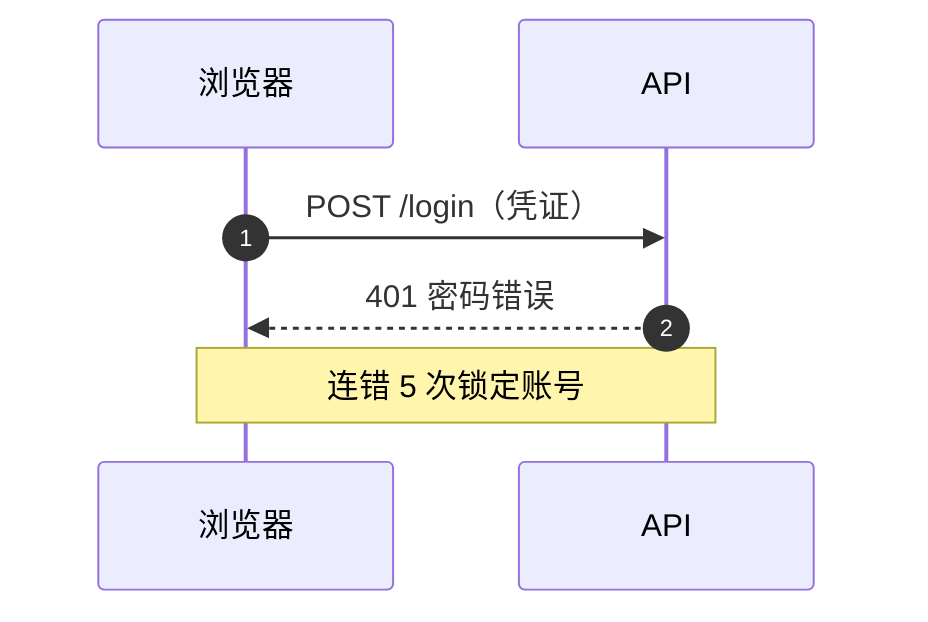
````

参与者变成列，消息变成行，整张图和日志里 API 对话的读法完全一致。实线箭头承载请求，虚线箭头承载响应，从上到下的阅读顺序就是事情发生的顺序。这是开发者继流程图之后最先上手的类型，因为作者和评审者用同一种方式读它。当一张时序图需要超过五个参与者时，通常该重画的是对话本身。

### 4.2 状态图：一个东西的一生

````markdown
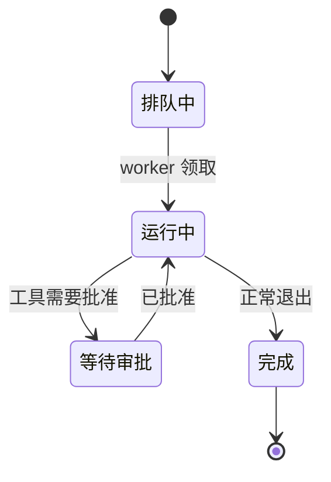
````

真实的生命周期还会失败，转移线照样装得下。同一个任务，加上重试和终态：

````markdown
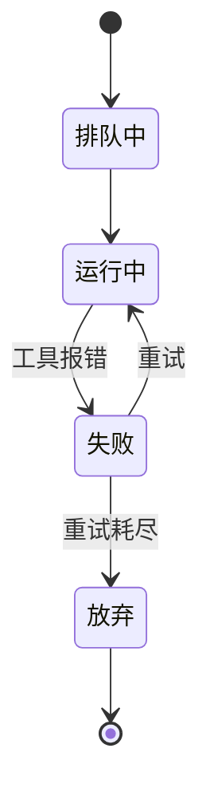
````

状态是名词，转移是把对象从一个状态搬到另一个状态的事件——所以这套语法几乎是状态机定义的字面转录。典型主角是所有有生命周期的东西：一个任务、一张订单、一次部署、一篇送审的文档。它和流程图的边界值得掰清楚：流程图回答「这个流程接下来发生什么」，状态图回答「这个东西接下来允许做什么」。

### 4.3 实体关系图：把数据库模式写成文字

````markdown
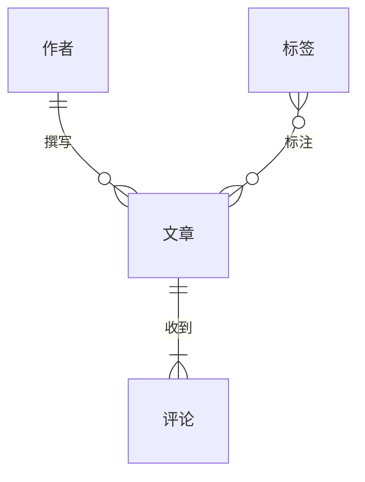
````

当字段名开始进入讨论，同一张图可以挂上属性块。实体下方用「类型 名字」的普通行列出字段：

````markdown
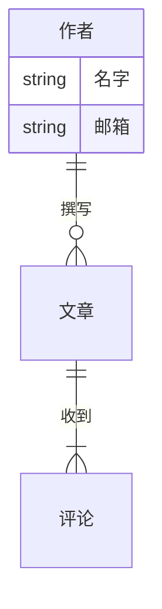
````

鸦爪记号被压缩成几个标点：`||--o{` 读作一对多零或一。在设计讨论里，通常只有关系线就够用，实体下的属性块可以等模式认真起来再补。回报和 Mermaid 其他地方一样：模式草图就住在提出它的那个 pull request 里，对它的修改呈现为可读的 diff。

### 4.4 甘特图：经得起改的排期

````markdown
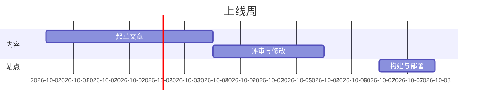
````

用 after 关键字把工期串起来，而不是写死日期，同一周就表达成了纯依赖关系——改一个工期，下游全部跟着动：

````markdown
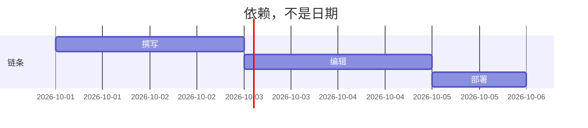
````

section 把相关任务分组，每个任务就是名字加工期，改排期就是改一行。在主要图类型里它最不「文本原生」——没人喜欢手算日期——跨度数月、要排资源的项目规划，还是交给真正的项目管理工具。但一个上线周、一轮内容冲刺，它完全撑得住，而且比任何表格截图都经得起评审。

### 4.5 饼图和思维导图：速写型选手

````markdown
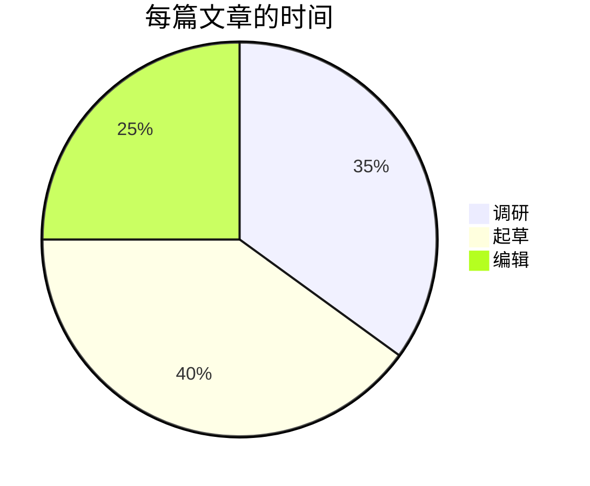
````

````markdown
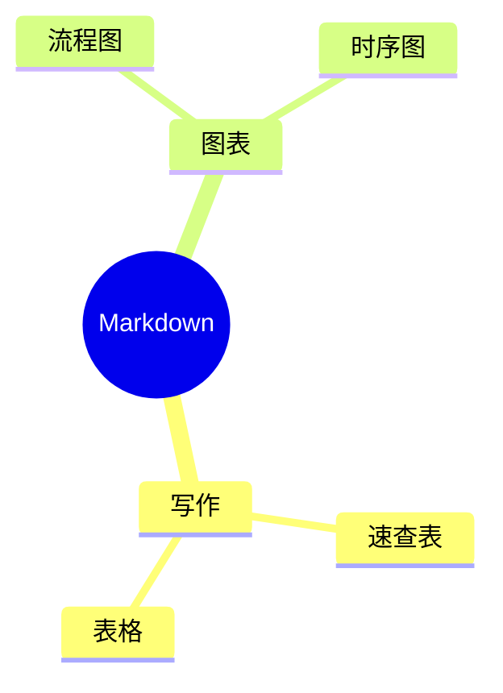
````

饼图在复盘和时间审计里挣得了一席之地：三到五块能讲清故事，再多就是噪音。思维导图是头脑风暴的头五分钟：没有箭头要操心，只有缩进，这也是它和 Obsidian 这类大纲工具如此合拍的原因。两者都渲染得小、读起来快——这正是一条文本图表该达到的及格线。

## 5. 语法坑：粘贴之前值得知道的事

Mermaid 读起来像英语，直到某张图因为一个要找十分钟的原因解析失败。好消息是，几乎所有语法错误都能归到一小撮习惯上，而且在各种图类型里通用。如果你为 Markdown 其余的标点规则常备一份 [Markdown 速查表](/zh/blog/markdown-cheat-sheet)，Mermaid 只新增一条习惯——给标签加引号——外加下面三个小点。

### 5.1 不是「纯单词」的标签都加引号

任何含标点的标签——括号、冒号、逗号、问号——必须用双引号包起来，否则解析器会把那些标点当语法读。这种失败很迷惑人：图一直解析得好好的，直到第一个特殊字符，整行当场去世。所以把坏版本和修好的版本放在一起看最直观：

````markdown
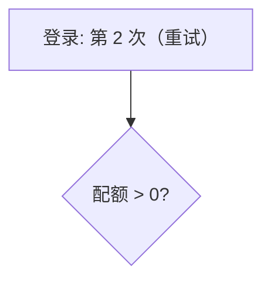
````

````markdown
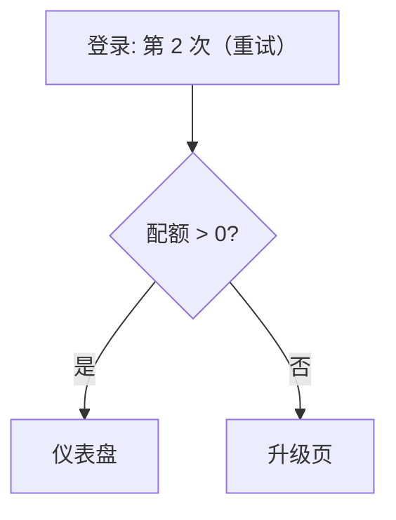
````

坏的那块死在没加引号的冒号、括号和花括号里的比较符上；修好的那块给每个标签都加了引号，放到哪里都能解析。养成加引号的习惯之后还有两个位置会咬人。箭头标签里带竖线是经典案例，因为竖线是箭头标签语法的定界符——把竖线文本放进引号即可拆弹；方括号标签里再套方括号则是引号也解决不了的嵌套问题，改掉内层文字才是正解。

### 5.2 节点 ID 和节点标签是两回事

在 `A[评审队列]` 里，`A` 是节点 ID，方括号里的文字只是显示内容。每条边、每条样式规则、每个 class 都引用 ID，所以显示文字可以随便改而完全不动图的接线。ID 必须唯一、不能带空格，而且取概念名——`review`、`publish`——比取字母更值。有一个保留字陷阱值得背下来：用小写 `end` 当节点 ID 会和关闭子图的 end 关键字相撞，叫 `finish` 或者加引号都行。

### 5.3 注释和语句分隔

`%%` 前缀注释掉一行的剩余部分，这是在图里留言的正道。语句靠换行分隔；分号也能当分隔符，所以 `A --> B; B --> C` 写在一行是合法的。陷阱在反方向：没加引号的标签里出现分号，语句会被提前终止——这其实就是第一条规则换了个帽子：给标签加引号。

### 5.4 中文与其他非 ASCII 标签

中日韩文字标签在主流平台上都能正确渲染，「ASCII 关键词 + 中文显示文本」的双语图在实践中完全常态。图类型和方向关键词（`flowchart`、`LR`、`sequenceDiagram`）保持 ASCII，本地文字只出现在标签里。两个注意点可以避开意外：含全角标点的中文标签记得加引号；另外某些 SVG 和 PDF 导出路径会替换字体，文字宽度随之变化，可能挤歪本来紧凑的布局——检查导出文件，别只看实时预览。

## 6. Mermaid 不擅长什么

对短板诚实，图表才维护得下去。精确的版式控制不是 Mermaid 的功能：自动布局决定方框的位置，大图——超过十几个节点还带交叉链接——无论你写得多仔细都会变成毛线团。像素级的品牌化样式也不是它的目标；主题存在，但精细的企业视觉规范会和工具对抗。交互式、动画式图表则完全超出范围。

务实的规则：Mermaid 擅长小型、结构化、记录逻辑的图——流程、时序、模式。它对海报级视觉是优雅地失败。当图表需要漂亮，那是绘图工具的工作；当图表需要真实、即时、可版本化，那是 Mermaid 的。

## 7. 主题与样式：比工具给你的更克制

Mermaid 自带主题——default、neutral、dark、forest、base——而且 init 指令可以在任何块的第一行选定主题、覆盖主题变量。图第一次要进品牌文档时，人很容易伸手去够它。但务实的建议是：比工具提供的更克制，因为样式恰恰是「离开你调好的那个平台就不再成立」的部分。指令长这样：

````markdown

````

但真正会上线的版本，通常整个指令都不写——默认主题，只给有意义的东西留一个强调色：

````markdown

````

init 行必须是块的第一行，它设置的一切只作用于当前这张图。classDef 占据中间地带：把命名样式定义一次，然后只涂在颜色承载含义的节点上——已完成、已失败、等待人工。这也是 Mermaid 图里颜色的全部正当用途：编码状态，不是装饰方框。

这一节里还藏着一个深色模式测试。GitHub 和 Obsidian 都会切换主题，一张在白底上调好的图——浅色填充、浅灰文字——在深色主题下可能整个洗掉。如果一张图非要自定义颜色才能读，上线前两种主题都过一遍；如果它用的是默认主题加一个强调色，通常两边都不用管。

## 8. AI 写 Mermaid 又快又好

「用自然语言描述一张图，拿到可编辑的图表代码」是一个近乎完美的 LLM 任务，它已经悄悄改变了图表的生产方式。把一段流程描述粘给 agent，要一张 Mermaid 流程图，得到的是可以靠改文字来修的文本——没有画布，没有拖拽。

这和 Markdown 生态的其余部分接成了一个闭环。读取 Markdown 文档的 agent，可以用同一文件格式提出它的架构图；评审者把图表的变更当代码 diff 来读。图表变成了 [AI 管线原生读写](/zh/blog/markdown-for-ai-pipelines)的文档的一部分——这正是文本图表属于 Markdown 工作流的全部理由。

### 8.1 一个好用的提示词模式

可靠的做法是先陈述事实、再要代码：图类型和方向、参与者名单、以及参与者之间按顺序排列的消息或步骤。一句「时序图，从上到下，参与者浏览器、API、数据库」，跟上按顺序列出的四条消息，返回的文本通常第一次就能解析。两个约束让它更稳：节点预算——十个以内，再多布局会遭殃——以及把语法节里的加引号规则复述一遍，让模型真的去执行。

```text
画一张 Mermaid 时序图，从上到下。
参与者按顺序：浏览器、API、数据库。
消息按顺序：
1. 浏览器发 POST /login，带凭证
2. API 查数据库里的用户
3. 数据库返回命中行，或为空
4. API 返回 200 带 token，或 401
控制在 8 个节点以内。含标点的标签一律加引号。
```

这个提示词有效，是因为它只是诚实地把图描述了一遍——参与者和消息序列本来就是时序图的全部内容，模型是在转录而不是编造。方向和参与者顺序决定布局，所以它们属于提示词，而不属于事后修补。如果第一次输出结构对但样子不对，直接改词；为了挪一条箭头重新生成整张图，是画布习惯在偷偷回归。

### 8.2 信任输出之前，先查这些

结构可以信，细节必须查。要查的清单：每条边标签写的是否是真正触发转移的那件事；参与者顺序是否和现实发生顺序一致；有没有源流程解释不了的节点凭空出现；用到的图类型是否在渲染矩阵列出的平台上受支持，而不只在最新的 Mermaid 版本里。这些没有一件比审一段散文更难——这恰恰是重点所在。

AI 最常犯的语法错误，就是语法坑那一节里的几个：标签里没加引号的标点、拿小写 `end` 当节点 ID、箭头不一致（该用 `--` 的地方写了 `-->`）、思维导图用 tab 而不是空格缩进。它们全是一个词的修改，编辑回路因此很快。一个错误如果超过一分钟还找不到原因，多半是平台版本差距而不是语法问题——先查前文的渲染矩阵。

## 9. 拆图：一张长太大的图怎么办

每个 Mermaid 用户迟早会遇到那张长太大的图。一条发布说明流水线，起点是六节点的流程图；六个月后变成二十个节点、二十六条边，横跨起草、评审、发布、分发，自动布局把它缠成一个没人看得下去的形状。重画小一点不是选项——二十个节点都是真的——于是解法是沿着自然的关节把它拆开。

关节就是「换人换工具」的交接处，它们把图分成三簇：起草循环、评审闸门、发布分发。每一簇变成自己的一张图，并带上显式的边界节点——入口节点如「来自评审」，出口节点如「去分发」——读者从任何一张子图进入，都能看到它把手交到哪里。三张图上方的一段短索引替掉了原来乱糟糟的交叉链接，负责路由；每张子图都控制在八个节点以内，稳稳待在布局仍然可读的疆域里。

````markdown
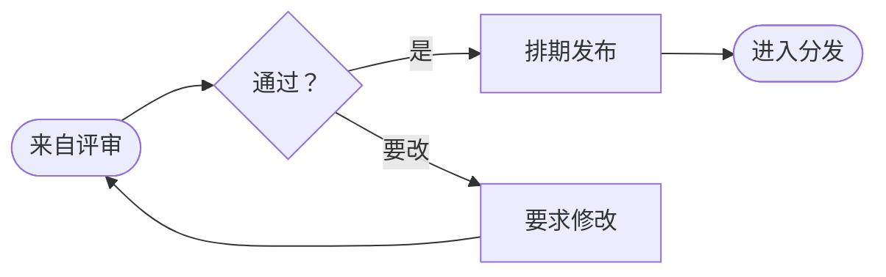
````

发布分发簇沿用同一个约定，入口节点复用闸门的出口，交接在两个方向上读起来都一样：

````markdown

````

拆分花了二十分钟，可读的结果此后扛住了十几次修改。教训可以推广：当一张 Mermaid 图变得不可读，答案几乎从来不是样式——而是这张图在承载不止一个想法，每个想法都配得上自己的一块地盘。每次文档需要维护的时候，三张小而无聊、但真实的图，都胜过一张惊人的毛线团。

## 10. 结语

Mermaid 把文档里最难维护的产物——图表——变成了几行与文档同生共死、同 diff 同消亡的文本。语法几分钟上手，截至 2026 年渲染支持已经足够广，而在所有不支持的地方，失败方式都是可读的伪代码。

下次某个流程说明需要一张图，试试先「描述」那张图，而不是去画它。
